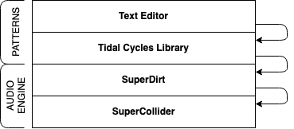

Tidal Cycles is not a big monolithic piece of software but consists of separate components:

1. A Pattern Library
   1. Your text editor
   2. The interpreter (Haskell) 
2. An audio engine
   1. SuperDirt for receiving messages and turning them to sound.
   2. SuperCollider, sending sound out.



## Launching Tidal 

There are two steps to launch Tidal:
1. Start **SuperCollider** and then **SuperDirt** inside of it.
2. Start **Tidal Cycles** from your text editor.

### Starting SuperCollider and SuperDirt 

#### From the IDE

The most minimalistic command you could use to start **SuperDirt** is the following one:

```c
SuperDirt.start;
```

This command will start the engine using the **SuperCollider** default server options.
Depending on your needs, you might want to adapt to a specific audio configuration.
You might also want to load more (or less) samples and finetune the memory or the latency of the audio server.

For a more *fine-tuned* startup configuration, take a look at the [configuration options](TODO: link to configuration page).

<!-- TODO: move to config section (keep this page basic) -->
[this script](https://raw.githubusercontent.com/musikinformatik/SuperDirt/develop/superdirt_startup.scd)

Evaluate the script or the line by selecting the text in the editor and pressing Ctrl/Cmd+Enter. You should see the following line in the logs after a few seconds:

```
SuperDirt: listening to Tidal on port 57120
```

You can now launch Tidal Cycles from your text editor and make music.

##### Boot SuperDirt everytime SuperCollider starts 

To tell SuperCollider to run SuperDirt on launch, you need to edit the SuperCollider startup file.

To access the startup file, open SuperCollider and click on `File > Open startup file`.
In that file you can paste and customise the following example startup file:

<!-- TODO: github embed? -->
https://raw.githubusercontent.com/musikinformatik/SuperDirt/develop/superdirt_startup.scd

This script also shows you how to load custom audio samples and how to deal with multichannel sound.

#### From the command line (for experienced users)

You can start `sclang` from the terminal to get an interactive prompt without having to launch the **SuperCollider** IDE. 


### Start Tidal Cycles

We will assume that you are working with the [Atom](https://atom.io) editor for now. For specific instructions concerning the text editor of your choice, take a look at the [editors page](TODO: link editors page).

1. Start Atom
2. Create a new file and save it with a filename that ends in `.tidal`, (e.g. `test.tidal`).
3. Open the Packages menu and select `TidalCycles -> Boot Tidal Cycles`. A small window will open at the bottom of the window containing the `t>` prompt (and hopefully no error messages).

To see if everything works, type the following pattern in the text editor and press `Shift+Enter` to evaluate it (`Ctrl+Enter` will evaluate multiple lines):

```haskell
d1 $ sound "bd sn"
```

If you hear sound, congratulations! If you get stuck, you are welcome to ask questions of the [community](TODO: link to community page).

As is common with free software, you have alternative choices for the different components that make up a Tidal Cycles system. **Atom** and **SuperDirt** might be all you ever need, but there are other editors and synths you can use. Take a look at the sidebar to see the alternatives.
